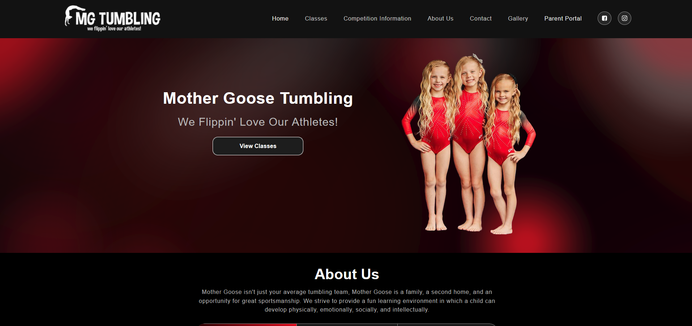
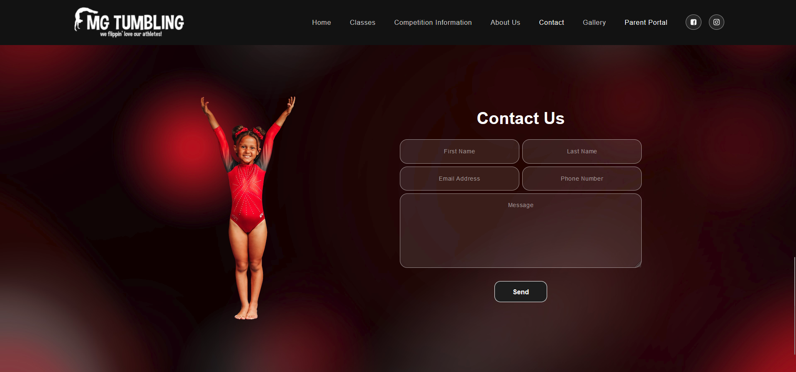
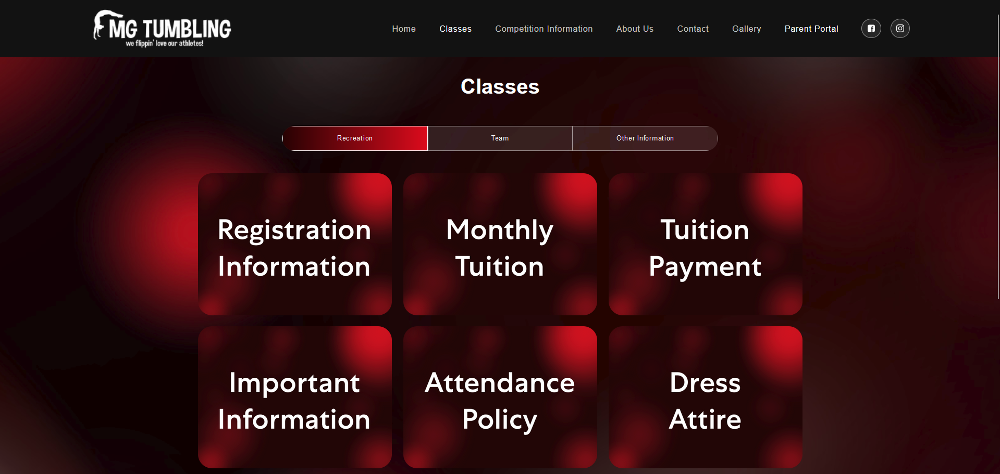

# Mother Goose Tumbling

## Personal Project for MGT:

This was a personal project for trying to upgrade and cut costs from WIX for Mother Goose Tumbling's website.

## Table of Contents

 * [User Story](#user-story)
 * [Acceptance Criteria](#acceptance-criteria)
 * [Installation](#installation)
 * [Application Demonstrations](#application-demonstrations)
 * [Live Application](#Live-Application)

## User Story

As a parent looking for a safe and engaging environment for my child to learn gymnastics, I want to explore the Mother Goose Tumbling website to find information about available classes, competition details, and team opportunities, so that I can make an informed decision about enrolling my child in the program. The website should be easy to navigate, visually appealing, and provide all the necessary details, including schedules, coach bios, and contact information, to ensure I feel confident in choosing the right program for my child.

## Acceptance Criteria

```md
GIVEN a website for Mother Goose Tumbling
WHEN I load the website
THEN I am presented with a page containing a header, a section for content, and a footer

WHEN I view the header
THEN I am presented with the Mother Goose Tumbling logo, and navigation with titles corresponding to different sections of the website

WHEN I view the navigation titles
THEN I am presented with the titles Home, Classes, Competition Information, About Us, Contact, Gallery, and Parent Portal, and the title corresponding to the current section is highlighted

WHEN I click on a navigation title
THEN I am presented with the corresponding section below the navigation without the page reloading and that title is highlighted

WHEN I load the website the first time
THEN the Home title and section are selected by default

WHEN I am presented with the Home section
THEN I see an introduction to Mother Goose Tumbling's homepage

WHEN I am presented with the Classes section
THEN I see a list of classes offered, each displayed in a card format with information such as class name, description, and schedule

WHEN I am presented with the Competition Information section
THEN I see information about upcoming competitions, results from past events, and dates for future competitions, with buttons linking to more details

WHEN I am presented with the Gallery section
THEN I see a gallery of images showcasing the current year as well as previous years

WHEN I am presented with the Contact section
THEN I see a contact form with fields for a name, email address, phone number (optional), and message

WHEN I am presented with the footer
THEN I am presented with text or icon links to the Mother Goose Tumbling social media profiles (e.g., Facebook, Instagram), contact information (address, phone number), and copyright text

WHEN I view the website on a mobile device
THEN the layout adjusts to fit the screen size, and navigation elements are accessible and functional
```

## Installation

To set up and run this About locally, follow these steps:

1. **Open Integrated Terminal**
   - Right-click on the main directory and select "Open in integrated terminal."

2. **Install Dependencies**
   - Run the command: `npm install`

3. **Build the About**
   - Run the command: `npm run build`

4. **Start the Development Server**
   - Run the command: `npm start`

5. **Deploy to GitHub Pages**
   - Run the command: `npm run deploy`


## Application Demonstrations





## Live Application

 